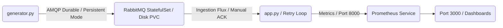

# 📡 CloudIA : Architecture Souveraine & IA pour la Supervision Télécom (Version v2 - Résiliente)

> 📊 **Note d'architecture :** Le schéma détaillé de cette infrastructure Cloud-Native est disponible au format vectoriel dans le fichier `schema-architecture.pdf` à la racine de ce dépôt.

## 🏗️ Contexte, Situation & Solution développée (v2)

### 1. La Situation Initialle
Faisant suite aux vulnérabilités identifiées dans la version `v1_limit` (où toute coupure matérielle effaçait les données en transit), cette version **v2** implémente une refonte complète de la persistance des données et de la sécurité des transactions.

### 2. La Solution de Robustesse Déployée
Pour garantir l'objectif de **zéro perte de données**, trois couches de sécurité industrielles ont été couplées :
*   **Persistance Physique (Infrastructure) :** Simulation d'un pattern **StatefulSet Kubernetes** associé à un **PersistentVolumeClaim (PVC)**. Nous utilisons un volume de stockage persistant Docker qui écrit physiquement la file d'attente sur le disque dur de la machine hôte.
*   **Durabilité AMQP (Broker) :** La file d'attente est déclarée immuable (`durable=True`) et le simulateur marque chaque message comme hautement persistant (`delivery_mode=2`). Si le serveur s'éteint, les données restent gravées sur le disque.
*   **Acquittement Transactionnel (Application) :** Passage au mode `auto_ack=False`. Le pod d'IA n'envoie son reçu de traitement (`ch.basic_ack`) **qu'une fois que l'algorithme d'IA a terminé sa prédiction**. Si le conteneur IA meurt au milieu du calcul, RabbitMQ conserve le message et le donne au pod suivant.

### 🛠️ Fichiers touchés & Opérations effectuées
*   `app.py` : Ajout d'une boucle de reconnexion automatique (`Retry Loop`), passage de la file en `durable=True`, et implémentation de `ch.basic_ack` manuel.
*   `generator.py` : Passage de la file en durable et forçage de l'envoi persistant via `delivery_mode=2`.
*   `docker-compose.test.yml` : Ajout de la section `volumes` et montage de la base de données `/var/lib/rabbitmq` sur le disque persistant global `rabbitmq_persistent_data`.
*   `test_observability.py` : Récriture complète du scénario de test. Il coupe RabbitMQ (`docker stop`), attend l'interruption, le rallume (`docker start`), vérifie la reconnexion automatique de l'IA et valide que le traitement reprend là où il s'était arrêté sans perdre de message (Le pipeline passe au **VERT 🎉**).

---

## 🏗️ Cartographie de l'Architecture & Rôle des Fichiers



### 🐍 Composants Applicatifs (Python)
*   `app.py` : Moteur analytique (Isolation Forest). Reçoit les flux de manière transactionnelle et sécurisée, et intègre la boucle de tolérance aux pannes réseau.
*   `generator.py` : Simulateur d'antenne 5G configuré pour l'injection persistante de données sur disque.
*   `test_observability.py` : Sonde avancée de validation de reprise après sinistre (*Disaster Recovery Test*).

### 📦 Configuration Infrastructure & Cloud (Kubernetes & Docker)
*   `Dockerfile` : Image de conteneurisation de la brique analytique IA.
*   `deployment.yaml` : Manifeste déclaratif Kubernetes (Ressources limitées et résilience de l'IA).
*   `prometheus-link.yaml` : Orchestration du scraping Prometheus toutes les 5 secondes.
*   `requirements.txt` : Liste des dépendances strictes (`scikit-learn`, `pika`, `prometheus-client`, `requests`).

### ⚙️ Automatisation (DevOps / MLOps)
*   `docker-compose.test.yml` : Laboratoire simulant l'infrastructure avec volumes d'écriture persistants (PVC).
*   `.github/workflows/ci-cd.yaml` : Pipeline GitHub Actions séparant la CI sans cache (Tests de reprise) et la CD (Packaging de l'image de production).

---

## 🚀 Procédure d'Exploitation du Livrable (Mode Résilient)

### 🛠️ Prérequis
*   Docker & Docker Compose
*   Un cluster Kubernetes local (**Kind**) et Helm v3

### 1. Validation de l'environnement (Test de Reprise après Sinistre)
Pour valider automatiquement que l'infrastructure survit à un crash total du serveur de messagerie :
```bash
docker compose -f docker-compose.test.yml build --no-cache
docker compose -f docker-compose.test.yml up --abort-on-container-exit --exit-code-from tester
```
*Le système s'allume, RabbitMQ est stoppé net en plein vol, puis est relancé. L'IA se reconnecte d'elle-même, extrait les messages conservés sur le disque dur, valide le traitement, et le pipeline se termine par un succès (0).*

### 2. Déploiement sur le Cluster Kubernetes Local (Kind)
Pour déployer la version robuste v2 en production :
```bash
# A. Déploiement du Broker RabbitMQ persistant via Helm
helm repo add bitnami https://bitnami.com
helm repo update
helm install telecom-broker bitnami/rabbitmq --set auth.username=user --set auth.password=password

# B. Injection de l'image IA finale v2 validée dans Kind et déploiement
kind load docker-image telecom-ia:latest --name telecom-cluster
kubectl apply -f deployment.yaml

# C. Activation du lien d'Observabilité pour Prometheus
kubectl apply -f prometheus-link.yaml
```

### 3. Visualisation de la Supervision (Grafana)
```bash
kubectl port-forward svc/telecom-monitor-grafana 3000:80
```
Utilisez la requête **PromQL** sur `http://localhost:3000` (admin/admin) pour voir la courbe reprendre immédiatement sa trajectoire après la panne :
```promql
rate(telecom_anomalies_detected_total[1m])
```
