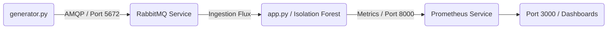

# 📡 CloudIA : Architecture Souveraine & IA pour la Supervision Télécom

> 📊 **Note d'architecture :** Le schéma détaillé de cette infrastructure Cloud-Native est disponible au format vectoriel dans le fichier `schema-architecture.pdf` à la racine de ce dépôt.

Ce projet implémente un prototype industriel d'**architecture Cloud-Native, asynchrone (Event-Driven) et monitorée** dédiée à la détection d'anomalies en temps réel sur des flux de télécommunications (ex: supervision d'antennes 5G). 

L'intégralité du système est conçue pour tourner sur une infrastructure souveraine conteneurisée et dispose d'un pipeline d'automatisation CI/CD complet.

---

## 🏗️ Cartographie de l'Architecture & Rôle des Fichiers

L'architecture est découpée en microservices découplés afin d'isoler les responsabilités :



### 🐍 Composants Applicatifs (Python)
*   `app.py` : Le cœur analytique du système. Il entraîne un modèle d'IA algorithmique (**Isolation Forest**) pour détecter les comportements réseau anormaux, consomme le flux de messages RabbitMQ de manière résiliente et expose des métriques applicatives au format standard **Prometheus**.
*   `generator.py` : Le simulateur réseau. Il simule un équipement de terrain (ex: Antenne de transmission d'Élancourt) et injecte en continu des métriques de trafic (paquets, erreurs, latence) ainsi que des anomalies transitoires dans le broker.
*   `test_observability.py` : La sonde de test automatique utilisée par la CI. Elle interroge le serveur de métriques de l'IA pour valider que les données transitent correctement et que le système est 100 % observable avant tout déploiement.

### 📦 Configuration Infrastructure & Cloud (Kubernetes & Docker)
*   `Dockerfile` : Spécifie l'empaquetage standardisé (image Linux ultra-légère, dépendances et scripts) de notre brique d'IA pour la rendre portable et hautement disponible.
*   `deployment.yaml` : Manifeste déclaratif Kubernetes assurant la résilience, le dimensionnement (replicas) et la gestion stricte des ressources (limites CPU/RAM) de l'IA.
*   `prometheus-link.yaml` : Déclare un `Service` réseau et un `PodMonitor` Kubernetes pour orchestrer la collecte automatique (*scraping*) des métriques par Prometheus toutes les 5 secondes.
*   `requirements.txt` : Centralise les versions strictes des bibliothèques nécessaires (`scikit-learn`, `pika`, `prometheus-client`, `requests`).

### ⚙️ Automatisation (DevOps / MLOps)
*   `docker-compose.test.yml` : Orchestre le laboratoire de test與 isolé en instanciant simultanément RabbitMQ, le Générateur, l'IA et le Testeur avec une configuration réseau dédiée.
*   `.github/workflows/ci-cd.yaml` : La feuille de route de notre pipeline **GitHub Actions**. Elle sépare strictement l'Intégration Continue (CI - vérification de la syntaxe et tests d'intégration de bout en bout sans cache) du Déploiement Continu (CD - packaging automatique de l'image de production `latest`).

---

## 🚀 Procédure d'Exploitation du Livrable

### 🛠️ Prérequis
*   Docker & Docker Compose
*   Un cluster Kubernetes local (**Kind** ou K3s)
*   Helm v3

### 1. Validation de l'environnement (Mode Intégration Continue)
Pour vérifier que l'ensemble du pipeline fonctionne instantanément sur n'importe quelle machine sans avoir à configurer Kubernetes à la main :
```bash
# Force le build sans cache et lance le scénario de test
docker compose -f docker-compose.test.yml build --no-cache
docker compose -f docker-compose.test.yml up --abort-on-container-exit --exit-code-from tester
```
*Le système va s'allumer, exécuter le test d'intégration, valider l'observabilité en vérifiant que le volume de paquets augmente, puis s'éteindre proprement avec un code de succès (0).*

### 2. Déploiement sur le Cluster Kubernetes Local (Kind)
Pour déployer l'infrastructure de supervision résiliente dans votre cluster de production :

```bash
# A. Déploiement du Broker RabbitMQ via Helm
helm repo add bitnami https://bitnami.com
helm repo update
helm install telecom-broker bitnami/rabbitmq --set auth.username=user --set auth.password=password

# B. Injection de l'image IA finale dans Kind et déploiement du pod
kind load docker-image telecom-ia:latest --name telecom-cluster
kubectl apply -f deployment.yaml

# C. Activation du lien d'Observabilité pour Prometheus
kubectl apply -f prometheus-link.yaml
```

### 3. Visualisation de la Supervision (Grafana)
Ouvrez un tunnel réseau sécurisé vers votre serveur Grafana d'infrastructure :
```bash
kubectl port-forward svc/telecom-monitor-grafana 3000:80
```
Rendez-vous sur votre navigateur à l'adresse `http://localhost:3000` (Identifiants : `admin` / `admin`). 

Vous pouvez ajouter une visualisation et utiliser la requête **PromQL** suivante pour afficher votre courbe d'alertes IA en temps réel :
```promql
rate(telecom_anomalies_detected_total[1m])
```
