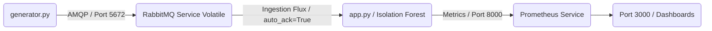

# 📡 CloudIA : Architecture Souveraine & IA pour la Supervision Télécom (Version v1_limit)

> 📊 **Note d'architecture :** Le schéma détaillé de cette infrastructure Cloud-Native est disponible au format vectoriel dans le fichier `schema-architecture.pdf` à la racine de ce dépôt.

## 🚨 Contexte, Situation & Limites Détectées (v1_limit)

### 1. La Situation Évaluée
Cette branche correspond à notre architecture initiale (**v1**). Le système intègre un pipeline *Event-Driven* découplé et un modèle d'IA pour l'analyse de trafic en continu. Cependant, cette configuration souffre de défauts structurels critiques de robustesse face aux incidents d'infrastructures lourds (pannes matérielles, coupures électriques, crashs de nœuds Kubernetes).

### 2. Analyse Technique & Défaillances du Code (Le Problème)
Le court-circuit ou l'extinction brutale du Broker RabbitMQ entraîne une **perte sèche et définitive de la totalité des messages en transit** (métriques d'antennes 5G). L'analyse approfondie du code révèle quatre vulnérabilités majeures :

#### 🔍 Défaillance 1 : Une file et des messages uniquement en mémoire vive (RAM)
Dans `generator.py` et `app.py` :
```python
channel.queue_declare(queue='telecom_traffic')                                # durable=False par défaut
channel.basic_publish(exchange='', routing_key='telecom_traffic', body=msg)   # delivery_mode=1 par défaut
```
Deux réglages par défaut masqués provoquent une perte de données à l'arrêt :
*   **File non durable (`durable=False`) :** La définition même de la file d'attente n'est pas sauvegardée de manière persistante par le broker. Au redémarrage de RabbitMQ, la file `telecom_traffic` cesse d'exister.
*   **Message transitoire (`delivery_mode=1`) :** Le message n'est pas écrit sur le disque dur. Même si la file était configurée comme durable, un message transitoire s'évapore instantanément au redémarrage électrique du conteneur.
*   *Conséquence :* Tout arrêt ou redémarrage du pod RabbitMQ efface l'infrastructure de la file et son contenu complet.

#### 🔍 Défaillance 2 : L'acquittement automatique prématuré (`auto_ack=True`)
Dans `app.py` :
```python
channel.basic_consume(queue='telecom_traffic', on_message_callback=callback, auto_ack=True)
```
Avec le paramètre `auto_ack=True`, RabbitMQ considère le message comme traité avec succès **dès qu'il l'a émis sur le réseau vers le conteneur d'IA**, et le supprime aussitôt de sa file. Si le pod IA subit un arrêt inattendu au milieu de sa prédiction (OOM Kill, dépassement de `limits` de ressources Kubernetes, mise à jour corrective), le message n'existe plus nulle part. Le broker est incapable de le distribuer à un autre nœud.
*   *Facteur aggravant :* Sans limite de préchargement (`prefetch_count`), le broker pousse en rafale l'intégralité du backlog au conteneur consommateur. Un crash du conteneur d'IA entraîne la perte de tout le tampon accumulé.

#### 🔍 Défaillance 3 : Absence de tolérance aux pannes réseau & Reconnexion
L'application d'IA ouvre une connexion de type `pika.BlockingConnection` une seule et unique fois lors de son initialisation :
*   Si l'IA s'allume quelques millisecondes avant le broker dans le cycle de démarrage Kubernetes, elle lève une exception `pika.exceptions.AMQPConnectionError` et le processus s'arrête immédiatement.
*   Si le broker tombe pendant le fonctionnement, la connexion bloquante se rompt définitivement. Le processus s'arrête et Kubernetes fait basculer le pod en boucle d'erreur infinie (`CrashLoopBackOff`).

#### 🔍 Défaillance 4 : Un stockage sous-jacent éphémère (Stateless)
Dans le fichier `docker-compose.test.yml`, aucun montage de volume n'est configuré sur l'arborescence `/var/lib/rabbitmq`. Les données de RabbitMQ vivent uniquement au sein du système de fichiers virtuel et éphémère du conteneur. Lors d'un déploiement sur un cluster de production, la durabilité dépend du volume persistant associé au pod. Sans file durable ni message persistant, l'infrastructure de stockage n'offre aucune protection contre la corruption.

### 📊 Récapitulatif Technique des Failles

| Élément du Code | Réglage Initial `v1_limit` | Conséquence en Cas de Panne | Gravité |
| :--- | :--- | :--- | :--- |
| **Déclaration de file** | `durable=False` | La file disparaît complètement au redémarrage | 🔴 Critique |
| **Publication (Publisher)** | `delivery_mode=1` | Les messages ne sont jamais écrits sur disque dur | 🔴 Critique |
| **Consommation (Consumer)** | `auto_ack=True` | Le message est détruit avant la fin du calcul de l'IA | 🔴 Critique |
| **Gestion de connexion** | Pas de retry loop | Arrêt immédiat du processus, `CrashLoopBackOff` | 🟠 Majeure |
| **Stockage du Broker** | Pas de volume persistant | Perte totale des données à la recréation du conteneur | 🟠 Majeure |

### 🛠️ Fichiers impactés & Opérations effectuées
*   `test_observability.py` : Entièrement récrit pour intercepter le démarrage du pipeline, injecter une commande système de coupure immédiate (`docker stop cloudia-rabbitmq-1`), simuler la perte de la RAM et renvoyer un code d'erreur `1` pour bloquer la CI/CD et forcer le passage du pipeline au **ROUGE ❌**, prouvant ainsi la limite structurelle.

---

## 🏗️ Cartographie de l'Architecture & Rôle des Fichiers

L'architecture est découpée en microservices découplés afin d'isoler les responsabilités :



### 🐍 Composants Applicatifs (Python)
*   `app.py` : Le cœur analytique du système (Isolation Forest). Consomme le flux RabbitMQ en mode volatil sans validation de traitement et expose ses métriques.
*   `generator.py` : Le simulateur réseau. Injecte les paquets en continu sans demander de garantie d'écriture au broker.
*   `test_observability.py` : La sonde de crash-test. Elle coupe le conteneur RabbitMQ en plein vol pour démontrer la perte d'observabilité et de données.

### 📦 Configuration Infrastructure & Cloud (Kubernetes & Docker)
*   `Dockerfile` : Spécifie l'empaquetage standardisé de la brique d'IA.
*   `deployment.yaml` : Manifeste déclaratif Kubernetes assurant la résilience et le dimensionnement de l'IA.
*   `prometheus-link.yaml` : Déclare un `Service` réseau et un `PodMonitor` Kubernetes pour orchestrer la collecte automatique des métriques.
*   `requirements.txt` : Centralise les versions strictes des bibliothèques nécessaires.

### ⚙️ Automatisation (DevOps / MLOps)
*   `docker-compose.test.yml` : Orchestre le laboratoire de test isolé sans aucun montage de volume disque pour RabbitMQ.
*   `.github/workflows/ci-cd.yaml` : La feuille de route de notre pipeline **GitHub Actions**. Elle exécute le scénario et isole le blocage de la CI.

---

## 🚀 Procédure d'Exploitation du Livrable (Démonstration du Crash)

### 🛠️ Prérequis
*   Docker & Docker Compose

### 1. Constater l'effondrement du système (Mode Intégration Continue)
Pour exécuter le scénario de test et voir la limite de la V1 s'activer :
```bash
docker compose -f docker-compose.test.yml build --no-cache
docker compose -f docker-compose.test.yml up --abort-on-container-exit --exit-code-from tester
```
*Le système va démarrer, analyser les premiers paquets, RabbitMQ va être stoppé, les métriques vont s'interrompre et le conteneur de test va s'éteindre avec un code d'erreur (1), faisant échouer le dépôt GitHub.*
