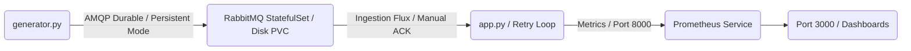

# 📡 CloudIA : Architecture Souveraine & IA pour la Supervision Télécom (Version v2 - Résiliente)

> 📊 **Note d'architecture :** Le schéma détaillé de cette infrastructure Cloud-Native est disponible au format vectoriel dans le fichier `schema-architecture.pdf` à la racine de ce dépôt.

## 🏗️ Contexte, Situation & Architecture Déployée (v2)

### 1. La Situation Initiale & Description Technique du Problème Rélobu
Faisant suite aux vulnérabilités identifiées dans la version `v1_limit`, notre pipeline de supervision souffrait d'un défaut structurel majeur : **la perte sèche de l'intégralité des messages télécoms en transit** en cas de panne matérielle ou électrique du Broker de messages. 

D'un point de vue mécanique, cette faille reposait sur trois facteurs techniques :
1.  **Volatilité AMQP par défaut :** La file d'attente réseau possédait le paramètre `durable=False` et le simulateur publiait des messages transitoires (`delivery_mode=1`), forçant le stockage exclusif des métriques dans la mémoire vive (RAM) de RabbitMQ. Tout crash vidait la file.
2.  **Acquittement automatique (`auto_ack=True`) :** Le broker supprimait le paquet de ses registres dès son émission sur le réseau vers le conteneur d'IA, sans attendre de validation. Si l'IA subissait un dysfonctionnement en plein calcul, le message était perdu à jamais.
3.  **Stockage éphémère :** Le laboratoire Docker Compose n'utilisait aucun volume persistant, interdisant toute reprise après sinistre.

### 2. La Solution de Robustesse Déployée
Pour garantir l'objectif de **zéro perte de données**, trois couches de sécurité industrielles ont été couplées dans cette version **v2** :
*   **Persistance Physique (Infrastructure) :** Simulation d'un pattern **StatefulSet Kubernetes** associé à un **PersistentVolumeClaim (PVC)**. Nous avons implémenté un volume de stockage persistant global Docker qui écrit physiquement les registres de la file d'attente sur le disque dur de la machine hôte.
*   **Durabilité AMQP (Broker) :** La file d'attente est configurée en mode immuable (`durable=True`) et le simulateur applique le tag `delivery_mode=2` (Message Persistant) dans les propriétés Pika. Si le serveur s'éteint, les données restent gravées sur disque.
*   **Acquittement Transactionnel (Application) :** Passage au mode `auto_ack=False`. Le pod d'IA n'envoie son reçu de traitement (`ch.basic_ack`) **qu'une fois que l'algorithme d'IA a terminé avec succès sa prédiction**. Si le conteneur IA meurt au milieu du calcul, RabbitMQ conserve le message et le distribue automatiquement au pod suivant dès son redémarrage.

### 🛠️ Fichiers touchés & Opérations effectuées
*   `app.py` : Intégration d'une boucle de reconnexion automatique (`Retry Loop`), configuration de la file en `durable=True`, et implémentation de la validation manuelle `ch.basic_ack`.
*   `generator.py` : Passage de la file en durable et forçage de l'envoi persistant via `delivery_mode=2`.
*   `docker-compose.test.yml` : Ajout de la section `volumes` et montage de la base de données `/var/lib/rabbitmq` sur le disque persistant global `rabbitmq_persistent_data`.
*   `test_observability.py` : Récriture complète du scénario de test. Il coupe RabbitMQ (`docker stop`), attend l'interruption, le rallume (`docker start`), vérifie la reconnexion automatique de l'IA et valide que le traitement reprend là où il s'était arrêté sans perdre de message (Le pipeline passe au **VERT 🎉**).

---

## 🏗️ Cartographie de l'Architecture & Rôle des Fichiers



### 🐍 Composants Applicatifs (Python)
*   `app.py` : Moteur analytique (Isolation Forest). Reçoit les flux de manière transactionnelle et sécurisée, et intègre la boucle de tolérance aux pannes réseau.
*   `generator.py` : Simulateur d'antenne 5G configuré pour l'injection persistante de données sur disque.
*   `test_observability.py` : Sonde avancée de validation de reprise après sinistre (*Disaster Recovery Test*).

### 📦 Configuration Infrastructure & Cloud (Kubernetes & Docker)
*   `Dockerfile` : Image de conteneurisation de la brique analytique IA.
*   `deployment.yaml` : Manifeste déclaratif Kubernetes (Déploiement de base de l'IA).
*   `prometheus-link.yaml` : Orchestration du scraping Prometheus toutes les 5 secondes.
*   `requirements.txt` : Liste des dépendances strictes (`scikit-learn`, `pika`, `prometheus-client`, `requests`).

### ⚙️ Automatisation (DevOps / MLOps)
*   `docker-compose.test.yml` : Laboratoire simulant l'infrastructure avec volumes d'écriture persistants (PVC).
*   `.github/workflows/ci-cd.yaml` : Pipeline GitHub Actions séparant la CI sans cache (Tests de reprise) et la CD (Packaging de l'image de production).

---

## 🚀 Procédure d'Exploitation du Livrable (Mode Résilient)

### 🛠️ Prérequis
*   Docker & Docker Compose
*   Un cluster Kubernetes local (**Kind**) et Helm v3

### 1. Validation de l'environnement (Test de Reprise après Sinistre)
Pour valider automatiquement que l'infrastructure survit à un crash total du serveur de messagerie :
```bash
docker compose -f docker-compose.test.yml build --no-cache
docker compose -f docker-compose.test.yml up --abort-on-container-exit --exit-code-from tester
```
*Le système s'allume, RabbitMQ est stoppé net en plein vol, puis est relancé. L'IA se reconnecte d'elle-même, extrait les messages conservés sur le disque dur, valide le traitement, et le pipeline se termine par un succès (0).*

### 2. Déploiement sur le Cluster Kubernetes Local (Kind)
Pour déployer la version robuste v2 en production :
```bash
# A. Déploiement du Broker RabbitMQ persistant via Helm
helm repo add bitnami https://bitnami.com
helm repo update
helm install telecom-broker bitnami/rabbitmq --set auth.username=user --set auth.password=password

# B. Injection de l'image IA finale v2 validée dans Kind et déploiement du pod
kind load docker-image telecom-ia:latest --name telecom-cluster
kubectl apply -f deployment.yaml

# C. Activation du lien d'Observabilité pour Prometheus
kubectl apply -f prometheus-link.yaml
```

### 3. Visualisation de la Supervision (Grafana)
```bash
kubectl port-forward svc/telecom-monitor-grafana 3000:80
```
Utilisez la requête **PromQL** sur `http://localhost:3000` (admin/admin) pour voir la courbe reprendre immédiatement sa trajectoire après la panne :
```promql
rate(telecom_anomalies_detected_total[1m])
```

---

## 🛑 Limite Majeure de la Version v2 : Le Piège de la Contention de Ressources (Resource Contention)

Bien que la v2 protège l'intégrité de nos flux de données, elle présente une **vulnérabilité architecturale sévère lors du passage à l'échelle analytique**. 

L'algorithme actuel `Isolation Forest` est léger en calcul. Cependant, si le projet évolue et bascule sur un modèle d'apprentissage profond (**Deep Learning** de type LSTM ou réseau de neurones convolutif lourd) pour analyser les paquets, le traitement devient extrêmement intensif en ressources matérielles.

### Description Technique de la Limite (`v2_limit`) :
Actuellement, notre fichier `deployment.yaml` ne contient **aucune directive d'isolation ou de bridage des ressources**. Le conteneur d'IA s'exécute avec le niveau de QoS (*Quality of Service*) le plus faible de Kubernetes : **BestEffort**.

Si le modèle d'IA subit un pic de charge ou une injection massive de données :
*   **Starvation CPU/RAM :** Le microservice d'IA va s'approprier de manière incontrôlée 100% des capacités de calcul (CPU) et de la mémoire vive (RAM) du nœud physique hôte sous-jacent.
*   **Crash des composants critiques par effet de bord :** N'ayant plus accès aux cycles CPU, le pod **RabbitMQ** colocalisé sur le même serveur va crasher par étouffement réseau. De la même façon, le pod **Prometheus** verra ses requêtes HTTP de scraping expirer (*Timeout*), rendant le tableau de bord Grafana aveugle.
*   **Risque d'OOM Killing en cascade :** Sans limites strictes, le noyau Linux de l'infrastructure détruira arbitrairement les pods prioritaires pour préserver le serveur, provoquant un effondrement complet du cluster.

*Cette faille fondamentale servira de base à notre prochaine version (**v2_limit** / **v3**), dans laquelle nous implémenterons l'isolation cgroups via la maîtrise des configurations `limits` et `requests` de Kubernetes.*
