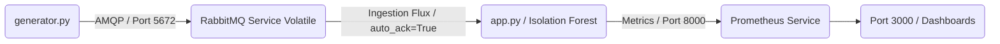

# 📡 CloudIA : Architecture Souveraine & IA pour la Supervision Télécom (Version v1_limit)

> 📊 **Note d'architecture :** Le schéma détaillé de cette infrastructure Cloud-Native est disponible au format vectoriel dans le fichier `schema-architecture.pdf` à la racine de ce dépôt.

## 🚨 Contexte, Situation & Limites détectées (v1_limit)

### 1. La Situation Évaluée
Cette branche correspond à notre architecture initiale (**v1**). Le système intègre un pipeline *Event-Driven* découplé et une IA d'analyse en continu. Cependant, cette configuration souffre d'un défaut critique de robustesse face aux incidents d'infrastructures lourds (pannes matérielles, coupures électriques, crashs de nœuds).

### 2. Le Problème & La Limite v1
Le court-circuit ou l'extinction brutale du Broker RabbitMQ entraîne une **perte sèche et définitive de la totalité des messages en transit** (métriques d'antennes 5G). 
*   **Mode Stateless Volatile :** La file d'attente réseau n'écrit aucune donnée sur un disque persistant. Tout réside en mémoire vive (RAM).
*   **Aquitf Automatique Périlleux :** L'IA consomme les messages avec le flag `auto_ack=True`. Le Broker supprime le paquet de sa mémoire dès qu'il l'envoie sur le réseau, sans attendre de savoir si l'IA a réussi son calcul ou si le conteneur a crashé.
*   **Preuve par la CI/CD :** Notre pipeline d'intégration continue bloque et passe volontairement au **ROUGE ❌** sur cette branche, prouvant de manière factuelle la vulnérabilité du système lors d'un crash simulé.

### 🛠️ Fichiers impactés & Opérations effectuées
*   `test_observability.py` : Entièrement récrit pour intercepter le démarrage du pipeline, injecter une commande système de coupure immédiate (`docker stop cloudia-rabbitmq-1`), simuler la perte de la RAM et renvoyer un code d'erreur `1` pour bloquer la CI/CD.

---

## 🏗️ Cartographie de l'Architecture & Rôle des Fichiers

L'architecture est découpée en microservices découplés afin d'isoler les responsabilités :



### 🐍 Composants Applicatifs (Python)
*   `app.py` : Le cœur analytique du système (Isolation Forest). Consomme le flux RabbitMQ en mode volatil sans validation de traitement et expose ses métriques.
*   `generator.py` : Le simulateur réseau. Injecte les paquets en continu sans demander de garantie d'écriture au broker.
*   `test_observability.py` : La sonde de crash-test. Elle coupe le conteneur RabbitMQ en plein vol pour démontrer la perte d'observabilité et de données.

### 📦 Configuration Infrastructure & Cloud (Kubernetes & Docker)
*   `Dockerfile` : Spécifie l'empaquetage standardisé de la brique d'IA.
*   `deployment.yaml` : Manifeste déclaratif Kubernetes assurant la résilience et le dimensionnement de l'IA.
*   `prometheus-link.yaml` : Déclare un `Service` réseau et un `PodMonitor` Kubernetes pour orchestrer la collecte automatique des métriques.
*   `requirements.txt` : Centralise les versions strictes des bibliothèques nécessaires.

### ⚙️ Automatisation (DevOps / MLOps)
*   `docker-compose.test.yml` : Orchestre le laboratoire de test與 isolé sans aucun montage de volume disque pour RabbitMQ.
*   `.github/workflows/ci-cd.yaml` : La feuille de route de notre pipeline **GitHub Actions**. Elle exécute le scénario et isole le blocage de la CI.

---

## 🚀 Procédure d'Exploitation du Livrable (Démonstration du Crash)

### 🛠️ Prérequis
*   Docker & Docker Compose

### 1. Constater l'effondrement du système (Mode Intégration Continue)
Pour exécuter le scénario de test et voir la limite de la V1 s'activer :
```bash
docker compose -f docker-compose.test.yml build --no-cache
docker compose -f docker-compose.test.yml up --abort-on-container-exit --exit-code-from tester
```
*Le système va démarrer, analyser les premiers paquets, RabbitMQ va être stoppé, les métriques vont s'interrompre et le conteneur de test va s'éteindre avec un code d'erreur (1), faisant échouer le dépôt GitHub.*
